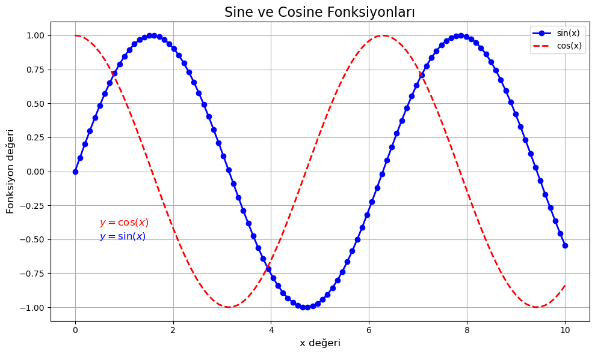
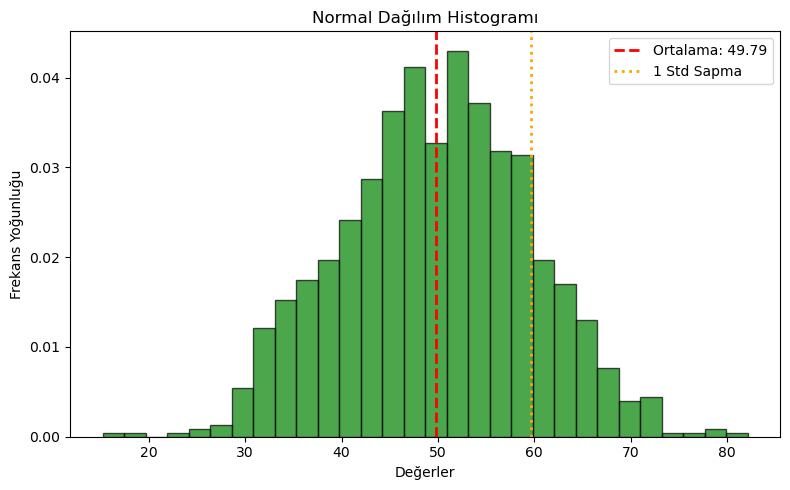
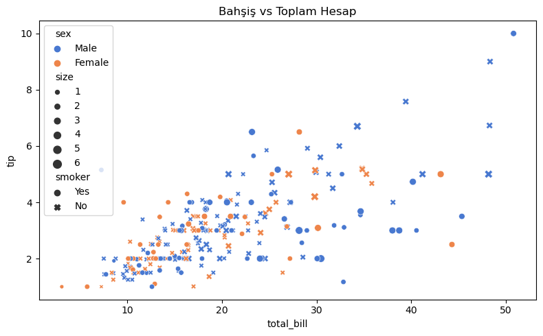
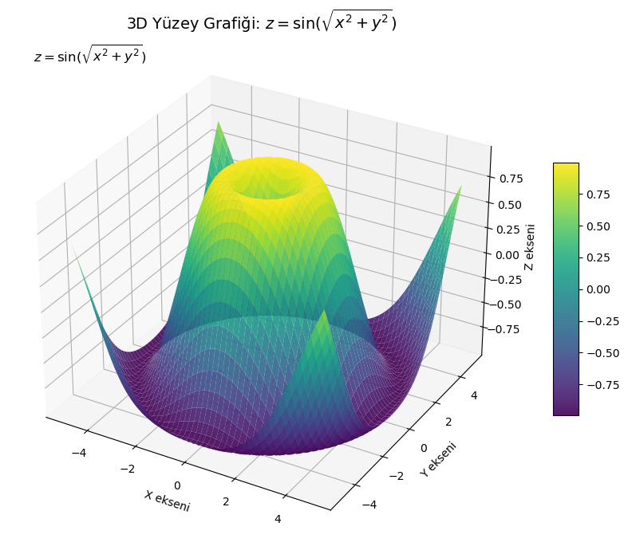

# 📊 Python Grafiklendirme Rehberi

Bu dokümanda Python'da veri görselleştirme yöntemleri laboratuvarda kullanılmak üzere üç ana kategori altında hazır şablon kullanımı amacı güdülerek açıklanmıştır:

---

## 1️⃣ Sade 2D Plot (Matplotlib)

```python
import matplotlib.pyplot as plt
import numpy as np

x = np.linspace(0, 10, 100)
y = np.sin(x)
y2 = np.cos(x)

plt.figure(figsize=(10, 6))
plt.plot(x, y, label='sin(x)', linestyle='-', color='blue', linewidth=2, marker='o')
plt.plot(x, y2, label='cos(x)', linestyle='--', color='red', linewidth=2)

plt.title('Sine ve Cosine Fonksiyonları', fontsize=16)
plt.xlabel('x değeri', fontsize=12)
plt.ylabel('Fonksiyon değeri', fontsize=12)

plt.text(0.5, 1.1, r'$y = \sin(x)$', fontsize=12, color='blue')
plt.text(0.5, 0.9, r'$y = \cos(x)$', fontsize=12, color='red')

plt.grid(True)
plt.legend()
plt.tight_layout()
plt.savefig("plot1_with_equation.png", dpi=300)
plt.show()
```



---

## 2️⃣ Histogram (Matplotlib)

```python
data = np.random.normal(loc=50, scale=10, size=1000)

plt.figure(figsize=(8, 5))
plt.hist(data, bins=30, color='green', edgecolor='black', alpha=0.7, density=True)

plt.title('Normal Dağılım Histogramı')
plt.xlabel('Değerler')
plt.ylabel('Frekans Yoğunluğu')

plt.axvline(np.mean(data), color='red', linestyle='dashed', linewidth=2, label=f'Ortalama: {np.mean(data):.2f}')
plt.axvline(np.mean(data) + np.std(data), color='orange', linestyle='dotted', linewidth=2, label='1 Std Sapma')
plt.legend()
plt.tight_layout()
plt.savefig("histogram.png", dpi=300)
plt.show()
```



---

## 3️⃣ Seaborn ile Gelişmiş Grafik

```python
import seaborn as sns
import pandas as pd

df = sns.load_dataset("tips")

plt.figure(figsize=(8, 5))
sns.scatterplot(data=df, x="total_bill", y="tip", hue="sex", style="smoker", size="size", palette="muted")
plt.title("Bahşiş vs Toplam Hesap")
plt.tight_layout()
plt.savefig("scatter_tips.png", dpi=300)
plt.show()
```



---

## 4️⃣ 3D Yüzey Grafiği

```python
from mpl_toolkits.mplot3d import Axes3D

x = np.linspace(-5, 5, 100)
y = np.linspace(-5, 5, 100)
X, Y = np.meshgrid(x, y)
Z = np.sin(np.sqrt(X**2 + Y**2))

fig = plt.figure(figsize=(10, 7))
ax = fig.add_subplot(111, projection='3d')
surf = ax.plot_surface(X, Y, Z, cmap='viridis', edgecolor='none', alpha=0.9)

ax.set_title("3D Yüzey Grafiği: $z = \sin(\sqrt{x^2 + y^2})$")
ax.set_xlabel('X ekseni')
ax.set_ylabel('Y ekseni')
ax.set_zlabel('Z ekseni')
ax.text2D(0.05, 0.95, r"$z = \sin(\sqrt{x^2 + y^2})$", transform=ax.transAxes, fontsize=12)
fig.colorbar(surf, shrink=0.5, aspect=10)

plt.tight_layout()
plt.savefig("3d_surface_plot.png", dpi=300)
plt.show()
```



---

## 📎 Appendix

- [Grafik HTML](Grafik.html)

