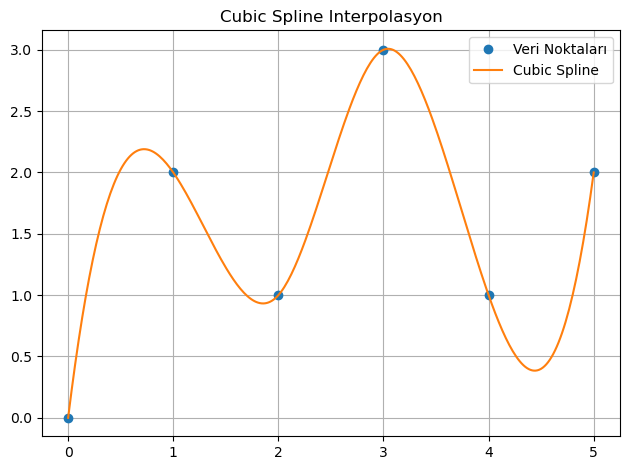
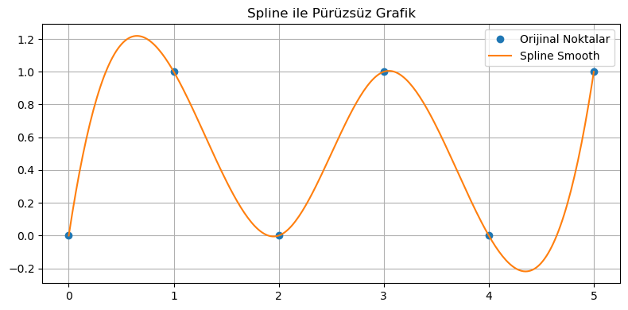
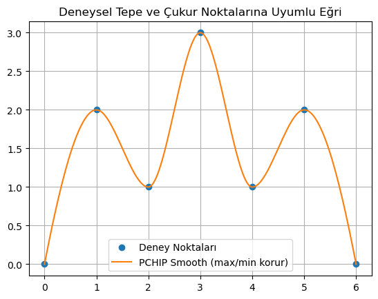
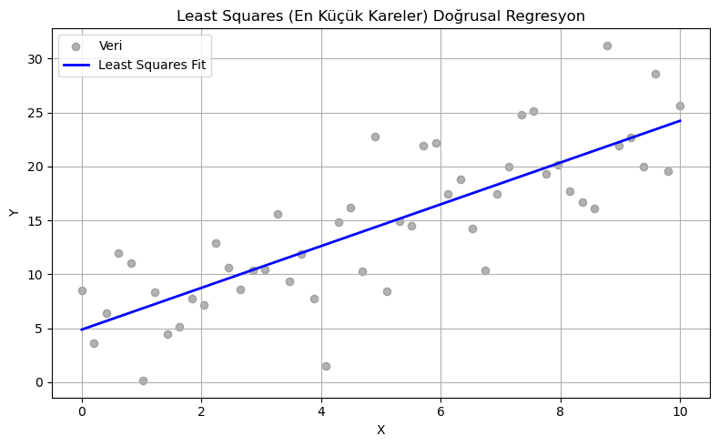
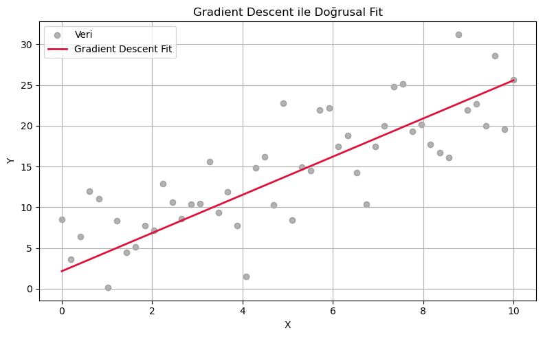
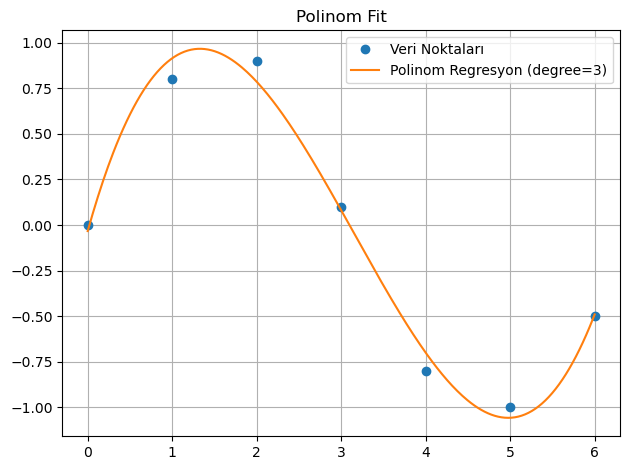
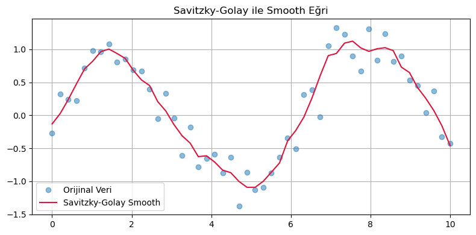

# 🎯 İnterpolasyon ve Regresyon Yöntemleri Rehberi

Bu rehber, interpolasyon ve regresyon türlerinin yaygın yöntemlerini inceleyerek; ihtiyaca uygun şablonların doğru kullanımını amaçlayacak şekilde tasarlanmıştır.

Önce şu notu okumanı öneririm → [Bkz Sayısal Analiz Kavramları](../../../../notes/sayısal-analiz-kavramları.md)

---

## 🔎 Ne Zaman Hangi Yöntem Kullanılır?

| Yöntem                   | Açıklama                                                                 | Kullanım Durumu                        |
|--------------------------|--------------------------------------------------------------------------|----------------------------------------|
| Cubic Spline             | Kübik eğrilerle pürüzsüz geçiş sağlar                                    | Matematiksel işlemlere açık        |
| make_interp_spline       | Kübik spline interpolasyon (özgün scipy yöntemi)                         | Pürüzsüzlük öncelikli ise      |
| PchipInterpolator        | Monotoniyi koruyan parça parça kübik interpolasyon                       | Tepe/çukur noktalar önemliyse          |
| Least Squares            | En küçük kareler yöntemiyle doğrusal regresyon                           | Yaklaşık modelleme için                |
| Gradient Descent         | Doğrusal fit için iteratif yaklaşım                                      | Öğrenmeye dayalı uygulamalar           |
| Polinom (polyfit) Regresyon        | Veriye uyan yüksek dereceli polinom fonksiyonları üretir                | Karmaşık, eğimli veri setlerinde       |
| Savitzky-Golay Regresyon | Gürültülü veriyi düzleştirirken aynı zamanda trendi korur               | Gürültü bastırma ve pürüzsüz türev alma|

---

## 1. 📌 Cubic Spline Interpolasyon

Veri noktaları arasında pürüzsüz geçişler sağlayan kübik spline yöntemi.

```python
from scipy.interpolate import CubicSpline
import numpy as np
import matplotlib.pyplot as plt

x = np.array([0, 1, 2, 3, 4, 5])
y = np.array([0, 2, 1, 3, 1, 2])

cs = CubicSpline(x, y)
x_new = np.linspace(x.min(), x.max(), 300)
y_new = cs(x_new)

plt.plot(x, y, 'o', label='Veri Noktaları')
plt.plot(x_new, y_new, '-', label='Cubic Spline')
plt.title('Cubic Spline Interpolasyon')
plt.legend()
plt.grid(True)
plt.tight_layout()
plt.show()
```



---

## 2. 📌 make_interp_spline (Spline Smooth)

```python
import numpy as np
import matplotlib.pyplot as plt
from scipy.interpolate import make_interp_spline

# Veri
x = np.array([0, 1, 2, 3, 4, 5])
y = np.array([0, 1, 0, 1, 0, 1])

# Daha sık aralıkla yeni x oluştur
x_new = np.linspace(x.min(), x.max(), 300)

# Smooth fonksiyon oluştur
spl = make_interp_spline(x, y, k=3)  # k=3 → cubic spline
y_smooth = spl(x_new)

# Grafik
plt.figure(figsize=(8, 4))
plt.plot(x, y, 'o', label="Orijinal Noktalar")
plt.plot(x_new, y_smooth, '-', label="Spline Smooth")
plt.legend()
plt.title("Spline ile Pürüzsüz Grafik")
plt.grid(True)
plt.tight_layout()
plt.show()

```



---

## 3. 📌 PCHIP Interpolasyon (Tepe & Çukur Noktaları Korur)

```python
from scipy.interpolate import PchipInterpolator
import matplotlib.pyplot as plt
import numpy as np

x = np.array([0, 1, 2, 3, 4, 5, 6])
y = np.array([0, 2, 1, 3, 1, 2, 0])  # Deneysel maksimum-minimum noktalar dahil

x_new = np.linspace(x.min(), x.max(), 300)
pchip = PchipInterpolator(x, y)
y_new = pchip(x_new)

plt.plot(x, y, 'o', label='Deney Noktaları')
plt.plot(x_new, y_new, '-', label='PCHIP Smooth (max/min korur)')
plt.legend()
plt.grid(True)
plt.title("Deneysel Tepe ve Çukur Noktalarına Uyumlu Eğri")
plt.show()
```



---

## 4. 📌 Least Squares Doğrusal Regresyon

```python
import numpy as np
import matplotlib.pyplot as plt

# Rastgele doğrusal veri
np.random.seed(0)
x = np.linspace(0, 10, 50)
y_true = 2.5 * x + 1.5
y = y_true + np.random.normal(scale=4, size=x.shape)

# Least Squares ile doğrusal regresyon
coeffs = np.polyfit(x, y, 1)  # 1. dereceden polinom
y_fit = np.polyval(coeffs, x)

# Grafik
plt.figure(figsize=(8, 5))
plt.scatter(x, y, color='gray', label='Veri', alpha=0.6)
plt.plot(x, y_fit, color='blue', linewidth=2, label='Least Squares Fit')
plt.title("Least Squares (En Küçük Kareler) Doğrusal Regresyon")
plt.xlabel("X")
plt.ylabel("Y")
plt.legend()
plt.grid(True)
plt.tight_layout()
plt.show()

print(f"Eğim (m): {coeffs[0]:.4f}, Y-kesişim (b): {coeffs[1]:.4f}")
```



---

## 5. 📌 Gradient Descent ile Doğrusal Regresyon

```python
import numpy as np
import matplotlib.pyplot as plt

# Veri
np.random.seed(0)
x = np.linspace(0, 10, 50)
y_true = 2.5 * x + 1.5
y = y_true + np.random.normal(scale=4, size=x.shape)

# Parametre başlangıcı
m, b = 0.0, 0.0
learning_rate = 0.001
epochs = 1000

# Gradient Descent
for _ in range(epochs):
    y_pred = m * x + b
    error = y_pred - y
    m_grad = (2 / len(x)) * np.dot(error, x)
    b_grad = (2 / len(x)) * np.sum(error)
    m -= learning_rate * m_grad
    b -= learning_rate * b_grad

y_fit = m * x + b

# Grafik
plt.figure(figsize=(8, 5))
plt.scatter(x, y, color='gray', label='Veri', alpha=0.6)
plt.plot(x, y_fit, color='crimson', linewidth=2, label='Gradient Descent Fit')
plt.title("Gradient Descent ile Doğrusal Fit")
plt.xlabel("X")
plt.ylabel("Y")
plt.legend()
plt.grid(True)
plt.tight_layout()
plt.show()

print(f"Eğim (m): {m:.4f}, Y-kesişim (b): {b:.4f}")
```



---

## 6. 📌 Polinom (polyfit) Regresyon

```python
import numpy as np
import matplotlib.pyplot as plt

# Örnek veri
x = np.array([0, 1, 2, 3, 4, 5, 6])
y = np.array([0, 0.8, 0.9, 0.1, -0.8, -1.0, -0.5])

# İnterpolasyon için daha sık x noktaları oluştur
x_new = np.linspace(x.min(), x.max(), 300)

# 3. dereceden polinom fit
z = np.polyfit(x, y, deg=3)
p = np.poly1d(z)
y_fit = p(x_new)

# Grafik
plt.plot(x, y, 'o', label='Veri Noktaları')
plt.plot(x_new, y_fit, '-', label='Polinom Regresyon (degree=3)')
plt.title('Polinom Fit')
plt.legend()
plt.grid(True)
plt.tight_layout()
plt.show()
```



---

## 7. 📌 Savitzky-Golay Regresyon

```python
import numpy as np
import matplotlib.pyplot as plt
from scipy.signal import savgol_filter

# Örnek veri (daha yoğun)
x = np.linspace(0, 10, 50)
y = np.sin(x) + 0.3 * np.random.randn(50)  # Gürültülü veri

# Smooth y
y_smooth = savgol_filter(y, window_length=9, polyorder=3)

# Grafik
plt.figure(figsize=(8, 4))
plt.plot(x, y, 'o', label="Orijinal Veri", alpha=0.5)
plt.plot(x, y_smooth, '-', label="Savitzky-Golay Smooth", color='crimson')
plt.legend()
plt.grid(True)
plt.title("Savitzky-Golay ile Smooth Eğri")
plt.tight_layout()
plt.show()
```



---

## 📎 Appendix

- [Interpolasyon ve Regresyon HTML](Interpolasyon-ve-Regresyonn.html)
