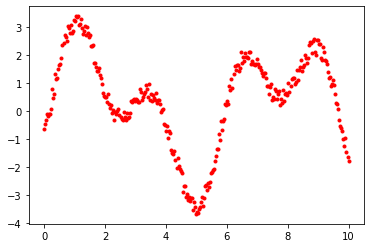
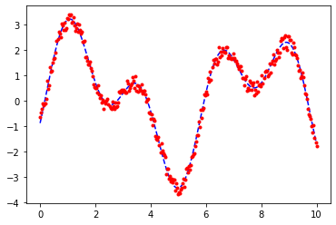

# 📊 Sayısal Analiz Uygulaması — Optimizasyon/Minimizasyon ve Hata Hesaplama

## 🧠 Genel Konu
**Numerical Analysis (Sayısal Analiz)**

Bu çalışma, gerçek dünya verileri ile sayısal bir modelin doğruluğunu karşılaştırmak amacıyla yapılan bir analizdir. Python programlama dili ve kütüphaneleri (NumPy, pandas, matplotlib) kullanılmıştır. Analiz süreci veri yükleme, model çıktısı ile karşılaştırma, grafikle görselleştirme ve hata metrikleri üretme adımlarından oluşmaktadır. 

Önce şu notu okumanı öneririm → [Bkz: Sayısal Analiz Kavramları](../../../../notes/sayısal-analiz-kavramları.md)

---

## 🔧 Kullanılan Kütüphaneler
```python
import numpy as np
import pandas as pd
import matplotlib.pyplot as plt
```
- `NumPy`: Matematiksel işlemler
- `pandas`: Veri yönetimi
- `matplotlib`: Grafik çizimi

---

## 📁 Veri Yapısı
Hazır veri, 3 sütundan oluşan bir pandas DataFrame olarak yapılandırılmıştır:
- `t`: Zaman veya x ekseni
- `y`: Gerçek (ölçülmüş) veri

DataFrame’in genel yapısı şu şekildedir:
```python
data.head()
```
```plaintext
     t         y
0  ...       ...
1  ...       ...
...
```

---

{ width="400px" align="center" }
> 📝 *İlk Veri Grafiği.*


## 📁 Model Uyarlaması

y = A₁·sin(ω₁·t + φ₁) + A₂·sin(ω₂·t + φ₂)

Seçilen denklem modeline uyarlama için verilen denklem fonksiyonu hata fonksiyonu oluşturulur.
İlk veri ve denklem hata fonksiyonuna uygulanır. 
Bu bileşimin optimize değerleri bulunur.

`res = opt.minimize(err_f,[3,2,2,1,0,-1])`

```python
plt.plot(data["t"], data["e"], "b--", label="Model")
plt.plot(data["t"], data["y"], "r.", label="Gerçek Veri")
plt.legend()
plt.title("Gerçek vs Model Verisi")
plt.xlabel("t")
plt.ylabel("Değer")
plt.show()
```

{ width="400px" align="center" }
> 📝 *İlk veri ve Fit Grafiği.*

---


## 📉 Hata Hesaplamaları

### 🔹 Karekok Toplam Kare Hata (erf1)
```python
erf1 = np.sqrt(((data["y"] - data["e"])**2).sum())
```

### 🔹 Toplam Mutlak Hata (erf2)
```python
erf2 = np.abs(data["y"] - data["e"]).sum()
```

### 🔹 (İsteğe Bağlı) R-Kare Hesabı
```python
ss_res = ((data["y"] - data["e"])**2).sum()
ss_tot = ((data["y"] - data["y"].mean())**2).sum()
r_squared = 1 - (ss_res / ss_tot)
```

---

## ✅ Sonuç
Bu çalışma, temel modelleme teknikleriyle sayısal verilerin analiz edilmesi ve model-doğruluk ilişkisinin sayısal olarak ortaya konulmasını kapsamaktadır. Python dilinde yapılan bu uygulama, hem görsel hem de istatistiksel açıdan model başarımını incelemek için uygun bir yöntemdir.

---

## 💡 Notlar
- Bu çalışma FIZ228 dersinin uygulamalı sınavı kapsamında yapılmıştır.
- Hataların düşük olması modelin iyi uydurulduğunu gösterir.
- R² eklenirse analiz daha sağlam temellendirilir.

---

## 📎 Appendix

- [Veri Seti (CSV)](modellemevehata-data.csv)
- [HTML Raporu](optimizasyon-minimizasyonn.html)