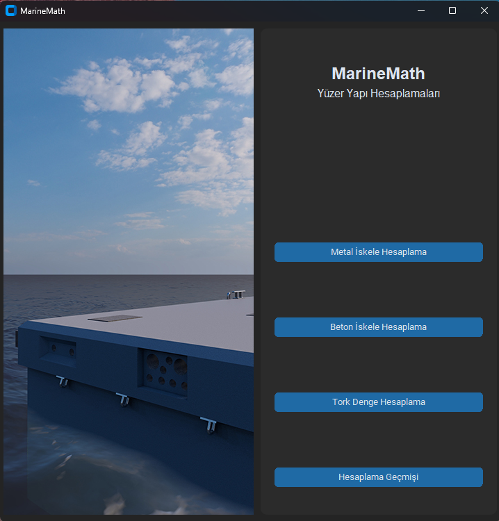
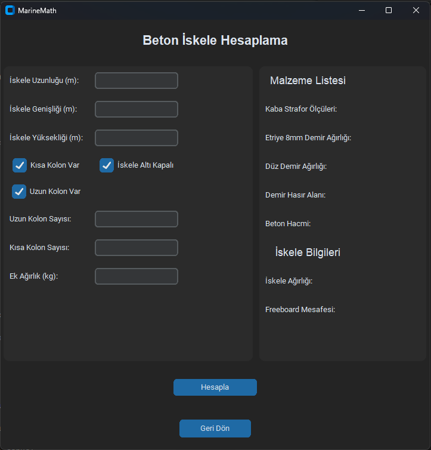
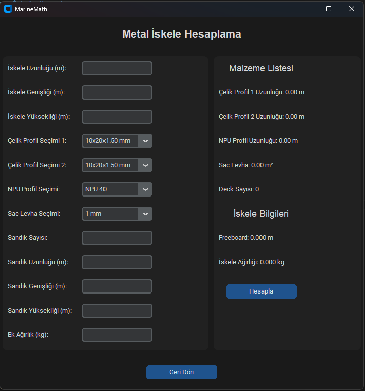
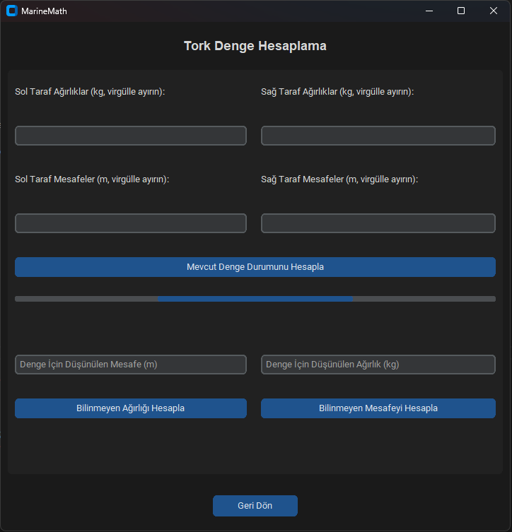
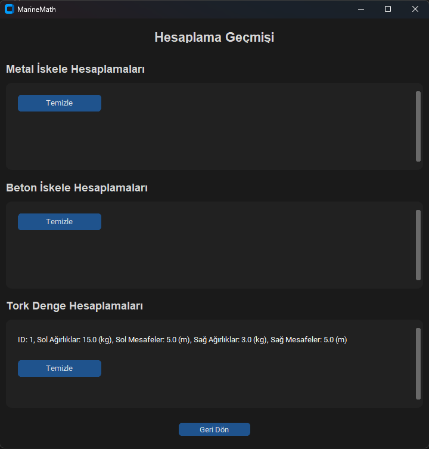

# 🖥️ MarineMathDesktop – Kullanıcı Deneyimi Rehberi

## 🏠 1. Uygulama Açılışı ve Ana Menü

**Arayüz:**

{ align="center" }
> 📝 *Ana Sayfa Tasarımı*

 * Sol Panel: Ana sayfa resmi (360x720 px)

 * Sağ Panel: 4 dikey buton (hesaplama modülleri)

 * Pencere Boyutu: 720x720 px

 * Tema: CustomTkinter dark theme

## 🔧 2. Hesaplama Modülleri

### 🏗️ A) Beton İskele Hesaplama
**Giriş Verileri:**

 * Uzunluk, genişlik, yükseklik (m)

 * Kolon var/yok seçenekleri (checkbox)

 * Kolon sayıları, ek ağırlık (kg)

**Sonuçlar:**

 * Malzeme listesi (demir, beton, strafor vb.)

 * Freeboard ve toplam iskele ağırlığı

**Arayüz:**

{ align="center" }
> 📝 *Yüzer Beton İskele Hesabı Sayfası Tasarımı*

### ⚙️ B) Metal İskele Hesaplama
**Giriş Verileri:**

 * İskele boyutları

 * Profil seçimi (ComboBox, 70+ seçenek)

 * Sac kalınlığı, sandık ölçüleri ve sayısı

 * Ek yük (kg)

**Sonuçlar:**

 * Malzeme listesi (Çelik profil uzunlukları, sac levha, deck vb.)

 * Freeboard, ve toplam iskele ağırlığı

**Arayüz:**

{ align="center" }
> 📝 *Yüzer Metal İskele Hesabı Sayfası Tasarımı*

### ⚖️ C) Tork Denge Hesaplama
**Giriş Verileri:**

 * Sol ve sağ taraf için ağırlık + mesafe listeleri

 * Bilinmeyen ağırlık veya mesafe hesaplaması

**Özellikler**:

 * Progress bar ile denge durumu

 * Görsel geri bildirim ("Fazla Ağırlık Sağ Tarafta")

**Arayüz:**

{ align="center" }
> 📝 *Tork Denge Hesabı Sayfası Tasarımı*

## 📊 3. Sonuçların Gösterimi
 * Hesaplama sonrası sonuçlar aynı pencerede gösterilir

 * Her sonuç ayrı label ile güncellenir

**Örnek:**

```Python
label_sonuc.configure(text=f"Freeboard: {freeboard:.3f} m")
```

 * Popup veya yeni pencere kullanılmaz

 * Hesap sonrası otomatik veritabanı kaydı yapılır

## 📚 4. Geçmiş Sayfası (history_page.py)
**3 kategori:**

 * Metal

 * Beton

 * Tork

**Her kayıt satırı:**

 * [Görüntüle] ID, uzunluk, ağırlık bilgisi

 * [Sil], [Yenile] butonları

**Detay:**

 * Görüntüle → Yeni pencere (readonly)

 * CRUD destekli

**Özellikler:**

 * Scrollable alanlar

 * CTk instance ile yeni pencere oluşturulur

```Python
entry_iskele_uzunluk.configure(state="readonly")
```
**Arayüz:**

{ align="center" }
> 📝 *Geçmiş Sayfası Tasarımı*

## 🔄 5. Navigasyon
Her sayfada "Geri Dön" butonu bulunur

Sayfalar arası geçiş:

```Python
root.destroy() → start_page() ile yapılır
```

Geçmiş detayları ayrı pencere olarak açılır

Örnek navigasyon:

```Python
back_button = ctk.CTkButton(
    root, text="Geri Dön", command=lambda: root.destroy() or start_page())
```

🎨 Kullanıcı Deneyimi Özeti

| Özellik         | Açıklama                   |
| --------------- | -------------------------- |
| Modern UI       | CustomTkinter dark mode    |
| Hızlı Sonuç     | Hesapla → Anlık gösterim   |
| Otomatik Kayıt  | Her sonuç DB’ye işlenir    |
| Detaylı Çıktı   | Malzeme + teknik değerler  |
| Kolay Geçiş     | Merkezi navigasyon sistemi |
| Geçmiş Kayıtlar | Filtreli ve erişilebilir   |

!!! note "Not"
    !!! note "📌 Son Not"
    MarineMath Desktop'ın kullanıcı arayüzü, mühendislik odaklı çözümleri sade bir deneyimle sunmak üzere tasarlandı. Hesaplama modüllerinin her biri, işlevsel ve bağımsız çalışır. Bu yapı hem geliştirilebilir hem de kullanıcı dostu olmayı hedefler.
